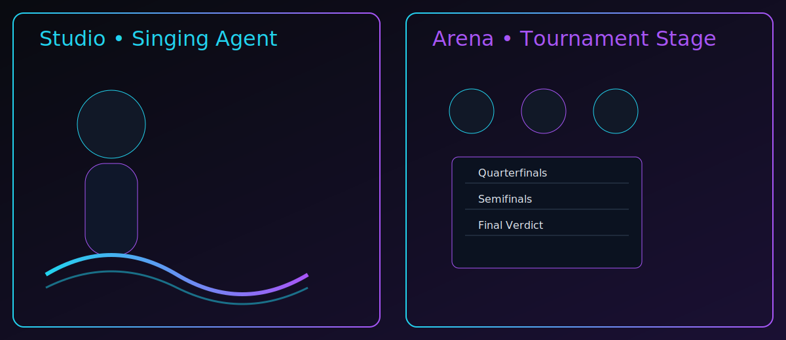

# Agentora v0.6 — Open Cosmos & Shared Eternity



[🚀 Try It Now: MicTek Rebellion](http://localhost:5173/band-mode)  
[🏠 Try Gathering](http://localhost:5173/gathering-mode)  
[🌳 Create Your First Legacy Agent](http://localhost:5173/legacy-mode)  
[🌌 Plant Your First Cosmos](http://localhost:5173/cosmos-mode)  
[📖 Share Your First Cosmos](http://localhost:5173/open-cosmos-mode)

Agentora is a local-first multi-agent orchestration studio for Ollama with seven modes:
- **Studio**
- **Band**
- **Arena**
- **Gathering**
- **Legacy**
- **Cosmos**
- **Open Cosmos**

## Open Cosmos highlights (v0.6)
- Share Cosmos as versioned `.agentora` package (encrypted zip + manifest-compatible structure)
- Import/merge `.agentora` files locally with conflict-aware timeline keep/skip behavior
- Version history + revocation support for shared packages
- Co-Creation Credits in package metadata
- Living Legacy Network view (opt-in local catalog for community-style cards)
- Optional Global Wisdom Archive cache (anonymized, local-only)
- Full backward compatibility intent with v0.5 cosmos payload shapes

## Privacy & safety defaults
- Local SQLite + local artifact storage only
- No telemetry
- Default network mode is localhost-only
- Sharing/discovery is optional and user-controlled
- No mandatory network calls; CoEvo-style flows remain adapters/opt-in

## Run locally
### Server
```bash
python -m venv .venv
source .venv/bin/activate
python -m pip install -r requirements.txt
uvicorn app.main:app --app-dir server --host 127.0.0.1 --port 8088
```

### Web
```bash
cd web
npm ci
npm run build
npm run dev
```

### Streamlit
```bash
python -m pip install -r requirements.txt
streamlit run streamlit_app.py
```

## Screenshot placeholders
- `docs/hero-soul-arena.svg`
- `docs/cosmos-map-placeholder.svg`
- `docs/open-cosmos-placeholder.svg`

## Dev scripts
- `scripts/dev.sh`
- `scripts/dev.ps1`
- `scripts/make_release_zip.py`
