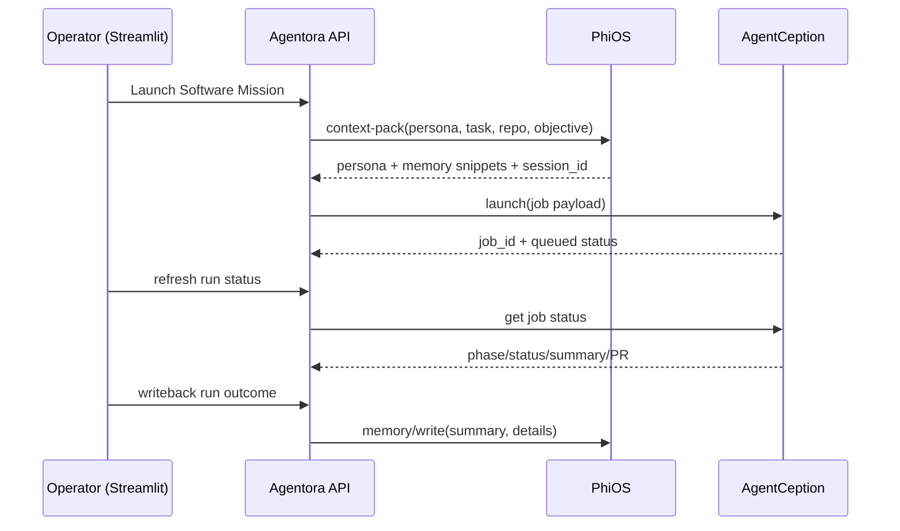
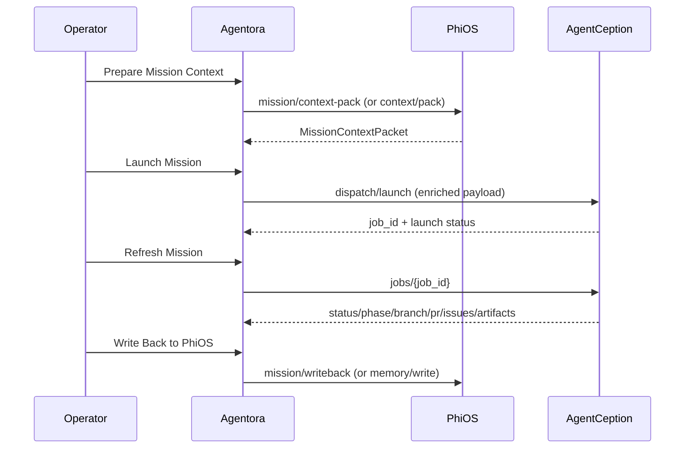

# Agentora v1.0.0 — Local Agent Operating Studio

Agentora is a **local-first, private-by-default, memory-aware agent operating studio** for chat, team orchestration, safe actions, and workflows.

## What Agentora does now

- **Local runtime:** Streamlit + FastAPI with SQLite persistence.
- **Memory-aware execution:** retrieval, contexts, lineage, duplicates/conflicts, maintenance visibility.
- **Team-capable orchestration:** plans, subgoals, handoffs, collaboration traces.
- **Safe action system:** approval-gated desktop/browser actions with policy/allowlist guardrails.
- **Workflow + Operator Mode:** run, replay, pause/resume/advance/retry/skip.
- **Optional worker assist:** offload path with graceful fallback when worker is unavailable.

## Quickstart (recommended one-PC path)

1. Copy `.env.example` to `.env`.
2. Keep mock defaults for first launch (`AGENTORA_USE_MOCK_OLLAMA=true`).
3. Start Agentora:
   - Windows: `launch_agentora.bat` or `launch_agentora.ps1`
   - macOS/Linux: manual commands below
4. Open Streamlit and verify `System Version` + `System Doctor` panels.

### Manual launch (cross-platform)
```bash
python -m pip install -r requirements.txt
uvicorn app.main:app --app-dir server --host 127.0.0.1 --port 8088
```
Second terminal:
```bash
AGENTORA_STREAMLIT_MODE=http AGENTORA_API_URL=http://127.0.0.1:8088 streamlit run app.py
```

## One PC vs Two PC

- **One PC (recommended):** local API + local Streamlit.
- **Two PC (optional):** add worker-assist node for distributed execution.
  See [docs/two-pc-setup.md](docs/two-pc-setup.md).

## Stable vs experimental

### Stable in v1.0.0
- Core run lifecycle
- Memory inspector + retrieval endpoints
- Team planning/handoffs/collaboration traces
- Action approvals/history
- Workflow run/replay
- Operator run control APIs

### Optional / experimental surfaces
- Cosmos / Open Cosmos / Garden / World Garden remain optional and labeled accordingly.

## Core API groups

- `system`: health/version/doctor/bootstrap
- `runs`: run lifecycle, traces, team/collaboration views
- `actions`: pending queue, approve/deny, history
- `workflows`: create/run/replay history
- `operator`: run controls and operator history
- `memory`: retrieval, contexts, lineage, maintenance
- `workers`: register/heartbeat/dispatch/job status

## Architecture summary

- **Streamlit:** primary operator UI
- **FastAPI:** orchestration and runtime APIs
- **SQLModel/SQLite:** local data storage by default
- **Ollama:** optional local model runtime (mock-friendly startup)
- **Worker queue:** optional offload/fallback execution

## Screenshots

- Placeholder hero asset: `docs/hero-soul-arena.svg`
- Capture environment-specific local screenshots for release/demo artifacts.

## Known limitations

- Some advanced actions depend on local desktop/browser capability availability.
- Worker mode requires configured/reachable worker URLs.
- Optional modules (Cosmos/Garden family) are not required for core GA operation.

## Documentation

- [docs/quickstart.md](docs/quickstart.md)
- [docs/operator-mode.md](docs/operator-mode.md)
- [docs/two-pc-setup.md](docs/two-pc-setup.md)
- [docs/troubleshooting.md](docs/troubleshooting.md)
- [docs/release-history.md](docs/release-history.md)
- [CHANGELOG.md](CHANGELOG.md)
- [RELEASE_NOTES.md](RELEASE_NOTES.md)
- [DEPLOYMENT.md](DEPLOYMENT.md)

## PhiOS + AgentCeption integration (Phase 1)

Agentora now includes an **optional thin integration bridge**:
- **PhiOS** owns identity/persona + memory context packs and writeback.
- **Agentora** owns the operator workflow and observability surface.
- **AgentCeption** owns software execution (dispatch/job/worktree/PR path).

### Environment flags

```bash
AGENTORA_PHIOS_ENABLED=false
AGENTORA_PHIOS_URL=http://127.0.0.1:8090
AGENTORA_PHIOS_API_KEY=
AGENTORA_PHIOS_TIMEOUT_SECONDS=20

AGENTORA_AGENTCEPTION_ENABLED=false
AGENTORA_AGENTCEPTION_URL=http://127.0.0.1:1337
AGENTORA_AGENTCEPTION_API_KEY=
AGENTORA_AGENTCEPTION_TIMEOUT_SECONDS=45

AGENTORA_INTEGRATIONS_MOCK=false
```

### Mock mode (no external services required)

Set `AGENTORA_INTEGRATIONS_MOCK=true` to test full operator flow without PhiOS/AgentCeption running.

### Local service mode

Point Agentora to local services:

```bash
AGENTORA_PHIOS_ENABLED=true
AGENTORA_PHIOS_URL=http://127.0.0.1:8090
AGENTORA_AGENTCEPTION_ENABLED=true
AGENTORA_AGENTCEPTION_URL=http://127.0.0.1:1337
```

If external systems require keys, set `AGENTORA_PHIOS_API_KEY` and/or `AGENTORA_AGENTCEPTION_API_KEY`.

### Minimal flow


```mermaid
sequenceDiagram
  participant Op as Operator (Streamlit)
  participant A as Agentora API
  participant P as PhiOS
  participant C as AgentCeption

  Op->>A: Launch Software Mission
  A->>P: context-pack(persona, task, repo, objective)
  P-->>A: persona + memory snippets + session_id
  A->>C: launch(job payload)
  C-->>A: job_id + queued status
  Op->>A: refresh run status
  A->>C: get job status
  C-->>A: phase/status/summary/PR
  Op->>A: writeback run outcome
  A->>P: memory/write(summary, details)
```

### Known Phase-1 limitations

- Endpoint contracts are intentionally thin and may need alignment with final PhiOS/AgentCeption schemas.
- Polling is operator-triggered (`refresh`) rather than full background workers.
- Writeback currently stores concise summary + raw payload snapshot for traceability.

## PhiOS + AgentCeption integration (Phase C)

Phase C upgrades the bridge into a structured mission loop:

1. **Pre-run PhiOS injection** via mission context packet preparation.
2. **Structured AgentCeption launch enrichment** mapped from PhiOS packet fields.
3. **Structured post-run outcome normalization** in Agentora.
4. **Structured PhiOS writeback** with status, branch, PR/issues/artifacts, and follow-ups.
5. **Mission history visibility** in Streamlit and integration run APIs.

### Mission lifecycle


```mermaid
sequenceDiagram
  participant Op as Operator
  participant A as Agentora
  participant P as PhiOS
  participant C as AgentCeption

  Op->>A: Prepare Mission Context
  A->>P: mission/context-pack (or context/pack)
  P-->>A: MissionContextPacket
  Op->>A: Launch Mission
  A->>C: dispatch/launch (enriched payload)
  C-->>A: job_id + launch status
  Op->>A: Refresh Mission
  A->>C: jobs/{job_id}
  C-->>A: status/phase/branch/pr/issues/artifacts
  Op->>A: Write Back to PhiOS
  A->>P: mission/writeback (or memory/write)
```

### Phase C demo (mock mode)

```bash
AGENTORA_INTEGRATIONS_MOCK=true
AGENTORA_PHIOS_ENABLED=false
AGENTORA_AGENTCEPTION_ENABLED=false
uvicorn app.main:app --app-dir server --host 127.0.0.1 --port 8088
AGENTORA_STREAMLIT_MODE=http AGENTORA_API_URL=http://127.0.0.1:8088 streamlit run app.py
```

Then open **Software Missions** and use: Prepare Mission Context → Launch Mission → Refresh Status → Write Back to PhiOS.

### Known limitations (Phase C)

- AgentCeption and PhiOS endpoint fields are normalized defensively and may require schema alignment with live deployments.
- Refresh is operator-triggered (no background poll worker yet).
- Writeback is manual by default to avoid repeated auto-writeback spam.
