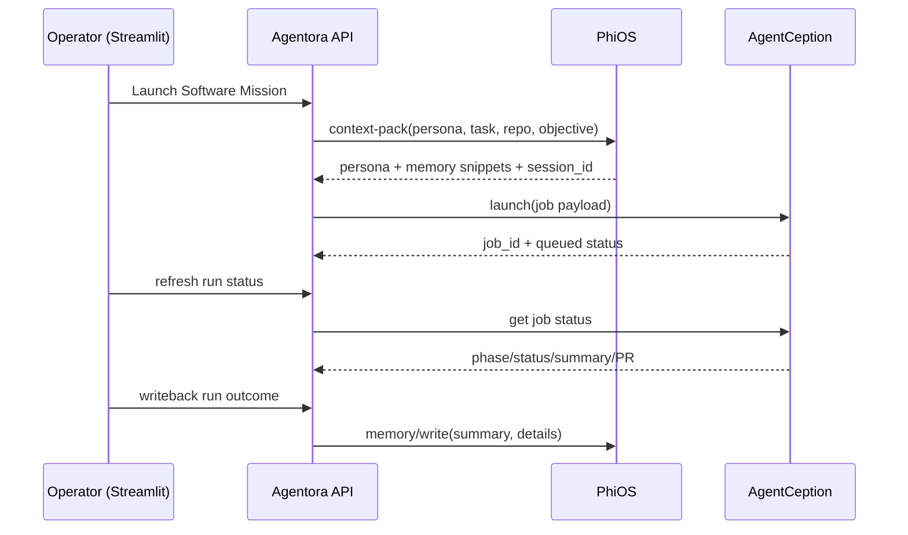
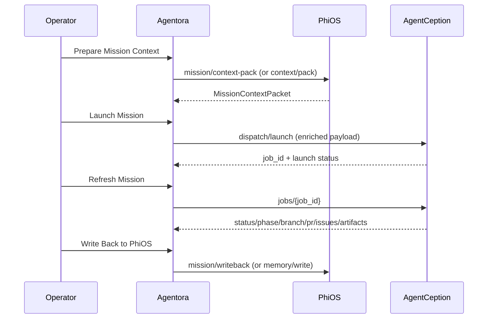

# Agentora v1.0.0 — Local Agent Operating Studio

Agentora is a **local-first, private-by-default, memory-aware agent operating studio** for chat, team orchestration, safe actions, and workflows.

## What Agentora does now

- **Local runtime:** Streamlit + FastAPI with SQLite persistence.
- **Memory-aware execution:** retrieval, contexts, lineage, duplicates/conflicts, maintenance visibility.
- **Team-capable orchestration:** plans, subgoals, handoffs, collaboration traces.
- **Safe action system:** approval-gated desktop/browser actions with policy/allowlist guardrails.
- **Workflow + Operator Mode:** run, replay, pause/resume/advance/retry/skip.
- **Optional worker assist:** offload path with graceful fallback when worker is unavailable.

## Quickstart (recommended one-PC path)

1. Copy `.env.example` to `.env`.
2. Keep mock defaults for first launch (`AGENTORA_USE_MOCK_OLLAMA=true`).
3. Start Agentora:
   - Windows: `launch_agentora.bat` or `launch_agentora.ps1`
   - macOS/Linux: manual commands below
4. Open Streamlit and verify `System Version` + `System Doctor` panels.

### Manual launch (cross-platform)
```bash
python -m pip install -r requirements.txt
uvicorn app.main:app --app-dir server --host 127.0.0.1 --port 8088
```
Second terminal:
```bash
AGENTORA_STREAMLIT_MODE=http AGENTORA_API_URL=http://127.0.0.1:8088 streamlit run app.py
```

## One PC vs Two PC

- **One PC (recommended):** local API + local Streamlit.
- **Two PC (optional):** add worker-assist node for distributed execution.
  See [docs/two-pc-setup.md](docs/two-pc-setup.md).

## Stable vs experimental

### Stable in v1.0.0
- Core run lifecycle
- Memory inspector + retrieval endpoints
- Team planning/handoffs/collaboration traces
- Action approvals/history
- Workflow run/replay
- Operator run control APIs

### Optional / experimental surfaces
- Cosmos / Open Cosmos / Garden / World Garden remain optional and labeled accordingly.

## Core API groups

- `system`: health/version/doctor/bootstrap
- `runs`: run lifecycle, traces, team/collaboration views
- `actions`: pending queue, approve/deny, history
- `workflows`: create/run/replay history
- `operator`: run controls and operator history
- `memory`: retrieval, contexts, lineage, maintenance
- `workers`: register/heartbeat/dispatch/job status

## Architecture summary

- **Streamlit:** primary operator UI
- **FastAPI:** orchestration and runtime APIs
- **SQLModel/SQLite:** local data storage by default
- **Ollama:** optional local model runtime (mock-friendly startup)
- **Worker queue:** optional offload/fallback execution

## Screenshots

- Placeholder hero asset: `docs/hero-soul-arena.svg`
- Capture environment-specific local screenshots for release/demo artifacts.

## Known limitations

- Some advanced actions depend on local desktop/browser capability availability.
- Worker mode requires configured/reachable worker URLs.
- Optional modules (Cosmos/Garden family) are not required for core GA operation.

## Documentation

- [docs/quickstart.md](docs/quickstart.md)
- [docs/operator-mode.md](docs/operator-mode.md)
- [docs/two-pc-setup.md](docs/two-pc-setup.md)
- [docs/troubleshooting.md](docs/troubleshooting.md)
- [docs/release-history.md](docs/release-history.md)
- [CHANGELOG.md](CHANGELOG.md)
- [RELEASE_NOTES.md](RELEASE_NOTES.md)
- [DEPLOYMENT.md](DEPLOYMENT.md)

## PhiOS + AgentCeption integration (Phase 1)

Agentora now includes an **optional thin integration bridge**:
- **PhiOS** owns identity/persona + memory context packs and writeback.
- **Agentora** owns the operator workflow and observability surface.
- **AgentCeption** owns software execution (dispatch/job/worktree/PR path).

### Environment flags

```bash
AGENTORA_PHIOS_ENABLED=false
AGENTORA_PHIOS_URL=http://127.0.0.1:8090
AGENTORA_PHIOS_API_KEY=
AGENTORA_PHIOS_TIMEOUT_SECONDS=20

AGENTORA_AGENTCEPTION_ENABLED=false
AGENTORA_AGENTCEPTION_URL=http://127.0.0.1:1337
AGENTORA_AGENTCEPTION_API_KEY=
AGENTORA_AGENTCEPTION_TIMEOUT_SECONDS=45

AGENTORA_INTEGRATIONS_MOCK=false
```

### Mock mode (no external services required)

Set `AGENTORA_INTEGRATIONS_MOCK=true` to test full operator flow without PhiOS/AgentCeption running.

### Local service mode

Point Agentora to local services:

```bash
AGENTORA_PHIOS_ENABLED=true
AGENTORA_PHIOS_URL=http://127.0.0.1:8090
AGENTORA_AGENTCEPTION_ENABLED=true
AGENTORA_AGENTCEPTION_URL=http://127.0.0.1:1337
```

If external systems require keys, set `AGENTORA_PHIOS_API_KEY` and/or `AGENTORA_AGENTCEPTION_API_KEY`.

### Minimal flow


```mermaid
sequenceDiagram
  participant Op as Operator (Streamlit)
  participant A as Agentora API
  participant P as PhiOS
  participant C as AgentCeption

  Op->>A: Launch Software Mission
  A->>P: context-pack(persona, task, repo, objective)
  P-->>A: persona + memory snippets + session_id
  A->>C: launch(job payload)
  C-->>A: job_id + queued status
  Op->>A: refresh run status
  A->>C: get job status
  C-->>A: phase/status/summary/PR
  Op->>A: writeback run outcome
  A->>P: memory/write(summary, details)
```

### Known Phase-1 limitations

- Endpoint contracts are intentionally thin and may need alignment with final PhiOS/AgentCeption schemas.
- Polling is operator-triggered (`refresh`) rather than full background workers.
- Writeback currently stores concise summary + raw payload snapshot for traceability.

## PhiOS + AgentCeption integration (Phase C)

Phase C upgrades the bridge into a structured mission loop:

1. **Pre-run PhiOS injection** via mission context packet preparation.
2. **Structured AgentCeption launch enrichment** mapped from PhiOS packet fields.
3. **Structured post-run outcome normalization** in Agentora.
4. **Structured PhiOS writeback** with status, branch, PR/issues/artifacts, and follow-ups.
5. **Mission history visibility** in Streamlit and integration run APIs.

### Mission lifecycle


```mermaid
sequenceDiagram
  participant Op as Operator
  participant A as Agentora
  participant P as PhiOS
  participant C as AgentCeption

  Op->>A: Prepare Mission Context
  A->>P: mission/context-pack (or context/pack)
  P-->>A: MissionContextPacket
  Op->>A: Launch Mission
  A->>C: dispatch/launch (enriched payload)
  C-->>A: job_id + launch status
  Op->>A: Refresh Mission
  A->>C: jobs/{job_id}
  C-->>A: status/phase/branch/pr/issues/artifacts
  Op->>A: Write Back to PhiOS
  A->>P: mission/writeback (or memory/write)
```

### Phase C demo (mock mode)

```bash
AGENTORA_INTEGRATIONS_MOCK=true
AGENTORA_PHIOS_ENABLED=false
AGENTORA_AGENTCEPTION_ENABLED=false
uvicorn app.main:app --app-dir server --host 127.0.0.1 --port 8088
AGENTORA_STREAMLIT_MODE=http AGENTORA_API_URL=http://127.0.0.1:8088 streamlit run app.py
```

Then open **Software Missions** and use: Prepare Mission Context → Launch Mission → Refresh Status → Write Back to PhiOS.

### Known limitations (Phase C)

- AgentCeption and PhiOS endpoint fields are normalized defensively and may require schema alignment with live deployments.
- Refresh is operator-triggered (no background poll worker yet).
- Writeback is manual by default to avoid repeated auto-writeback spam.

## PhiOS + AgentCeption integration (Phase D)

Phase D makes Software Missions durable and operator-friendly with optional background automation.

### New capabilities

- **Background mission watcher** (env-gated): periodically refreshes active runs.
- **Debounced auto-writeback policy** (env-gated): prevents repeated duplicate PhiOS writebacks.
- **Mission history filters and compare**: status/repo/persona/writeback/search filtering + side-by-side compare.
- **Optional MCP mission operations exposure** (env-gated) for external clients.

### Phase D env flags

```bash
AGENTORA_MISSIONS_WATCHER_ENABLED=false
AGENTORA_MISSIONS_WATCHER_INTERVAL_SECONDS=20
AGENTORA_MISSIONS_WATCHER_MAX_ACTIVE_RUNS=25
AGENTORA_MISSIONS_AUTO_WRITEBACK=false
AGENTORA_MISSIONS_WRITEBACK_DEBOUNCE_SECONDS=300
AGENTORA_MISSIONS_MCP_ENABLED=false
```

### Lifecycle

Prepare -> Launch -> Watch/Refresh -> Writeback -> Review/Compare

### Optional MCP mission ops

When `AGENTORA_MISSIONS_MCP_ENABLED=true`, Agentora exposes mission operations via:

- `GET /api/integrations/mcp/capabilities`
- `POST /api/integrations/mcp/call`

Supported MCP tool names:
- `prepare_mission`
- `launch_mission`
- `refresh_mission`
- `writeback_mission`
- `get_mission`
- `list_missions`
- `get_mission_timeline`

### Known limitations (Phase D)

- Watcher is intentionally lightweight for single-process local use.
- Auto-writeback is conservative and debounced; manual writeback remains primary for operator control.
- MCP exposure is an HTTP-backed extension point (not a full separate MCP server runtime yet).

## PhiOS + AgentCeption integration (Phase E)

Phase E adds observability, trust, and mission intelligence to the existing mission loop.

### New Phase E capabilities

- Watcher telemetry and recent watcher event inspection.
- Structured run compare diffs with interpretation and delta sections.
- Heuristic mission evaluation signals (score/confidence/readiness/risk) persisted on each run.
- Richer timeline events including watcher refresh and writeback lifecycle events.
- MCP policy hardening with optional API key, read-only mode, and allowed-tool filtering.
- Aggregate mission insights for operators.

### New routes

- `GET /api/integrations/metrics`
- `GET /api/integrations/watcher/events`
- `GET /api/integrations/insights`
- `GET /api/integrations/runs/compare?left_run_id=...&right_run_id=...` (structured diff)

### MCP hardening env flags

```bash
AGENTORA_MISSIONS_MCP_API_KEY=
AGENTORA_MISSIONS_MCP_READ_ONLY=false
AGENTORA_MISSIONS_MCP_ALLOWED_TOOLS=
```

### Heuristic evaluation note

Mission score and confidence fields are **heuristic operator aids**, not objective truth. They summarize observable mission artifacts and state transitions to help triage and decision-making.

### Local demo (mock, with watcher + insights)

```bash
AGENTORA_INTEGRATIONS_MOCK=true
AGENTORA_MISSIONS_WATCHER_ENABLED=true
AGENTORA_MISSIONS_AUTO_WRITEBACK=true
uvicorn app.main:app --app-dir server --host 127.0.0.1 --port 8088
AGENTORA_STREAMLIT_MODE=http AGENTORA_API_URL=http://127.0.0.1:8088 streamlit run app.py
```

## PhiOS + AgentCeption integration (Phase F)

Phase F extends mission observability into mission intelligence and portability.

### New capabilities

- Event retention/compaction controls with TTL and per-run caps.
- Mission export/import with versioned JSON schema.
- Optional alert hooks for terminal state, writeback failure, and high-risk signals.
- Cohort analysis routes for grouped mission intelligence.
- Weighted compare severity output (`none/low/medium/high/critical`).
- Heuristic calibration through env-tunable scoring thresholds.
- Snapshot route for replay-oriented inspection prep.

### New Phase F env flags

```bash
AGENTORA_MISSIONS_EVENTS_TTL_DAYS=30
AGENTORA_MISSIONS_EVENTS_MAX_PER_RUN=200
AGENTORA_MISSIONS_COMPACTION_ENABLED=false
AGENTORA_MISSIONS_COMPACTION_INTERVAL_SECONDS=600

AGENTORA_MISSIONS_ALERTS_ENABLED=false
AGENTORA_MISSIONS_ALERTS_WEBHOOK_URL=
AGENTORA_MISSIONS_ALERTS_ON_TERMINAL=true
AGENTORA_MISSIONS_ALERTS_ON_WRITEBACK_FAILURE=true
AGENTORA_MISSIONS_ALERTS_ON_HIGH_RISK=true

AGENTORA_MISSIONS_SCORE_PR_BONUS=25
AGENTORA_MISSIONS_SCORE_TERMINAL_SUCCESS_BONUS=30
AGENTORA_MISSIONS_SCORE_WRITEBACK_SUCCESS_BONUS=10
AGENTORA_MISSIONS_SCORE_FAILURE_PENALTY=20
AGENTORA_MISSIONS_SCORE_SUMMARY_MIN_LENGTH=80
AGENTORA_MISSIONS_RISK_THRESHOLD_HIGH=2
AGENTORA_MISSIONS_CONFIDENCE_THRESHOLD_HIGH=75
AGENTORA_MISSIONS_CONFIDENCE_THRESHOLD_MEDIUM=45
```

### Phase F routes

- `GET /api/integrations/retention`
- `POST /api/integrations/retention/compact`
- `GET /api/integrations/export`
- `POST /api/integrations/import`
- `GET /api/integrations/alerts/events`
- `GET /api/integrations/cohorts`
- `GET /api/integrations/cohorts/summary`
- `GET /api/integrations/runs/{run_id}/snapshot`

### Export/import notes

- Export format is `schema_version=mission-export-v1` JSON.
- Import validates schema version and skips existing IDs where possible.
- Import is additive/non-destructive by default.

### Heuristic and severity note

Mission score, confidence, and compare severity are **operator-facing heuristics**, not objective truth.

## PhiOS + AgentCeption integration (Phase G)

Phase G introduces branching/replay primitives with immutable provenance and lineage-aware operations.

### New capabilities

- Snapshot-based replay draft creation and launch-from-draft workflows.
- Immutable provenance lineage fields (`parent_run_id`, `root_run_id`, `lineage_depth`, source snapshot hash, replay metadata).
- Snapshot hash generation for integrity/provenance validation.
- Lineage and provenance APIs for ancestry/descendant views.
- Replay-aware compare context integrated with existing diff/severity model.
- Optional export signing support (HMAC) for bundle integrity checks.

### Replay policy env flags

```bash
AGENTORA_MISSIONS_REPLAY_ENABLED=true
AGENTORA_MISSIONS_REPLAY_ALLOW_REPO_CHANGE=false
AGENTORA_MISSIONS_REPLAY_MAX_LINEAGE_DEPTH=20
AGENTORA_MISSIONS_REPLAY_REQUIRE_PROVENANCE_NOTE=false
AGENTORA_MISSIONS_SIGN_EXPORTS=false
AGENTORA_MISSIONS_EXPORT_SIGNING_KEY=
```

### New Phase G routes

- `POST /api/integrations/runs/{run_id}/fork`
- `POST /api/integrations/runs/{run_id}/replay`
- `POST /api/integrations/runs/{run_id}/launch-from-draft`
- `GET /api/integrations/runs/{run_id}/lineage`
- `GET /api/integrations/lineage/{root_run_id}`
- `GET /api/integrations/runs/{run_id}/provenance`

### Lifecycle

Original Run -> Snapshot -> Fork Draft -> Replay Launch -> Lineage Compare

### Replay safety model

Immutable provenance fields are preserved across forks/replays:
- source snapshot hash
- parent/root linkage
- lineage depth
- immutable origin created timestamp

Mutable replay draft fields:
- mission title
- objective
- operator intent
- acceptance criteria
- constraints
- persona
- dry_run
- repo only when policy allows

### Known limitations

- Replay launch currently creates a new launched run from draft state (draft remains a historical artifact).
- Export signatures are optional local integrity hints, not external trust attestations.

## PhiOS + AgentCeption integration (Phase H)

Phase H adds lineage-aware branch-set planning for comparative mission execution under one root objective.

### Branch-set and strategy capabilities

- Branch-set metadata on each run (`branch_set_id`, `branch_label`, `branch_strategy`, `decision_status`, `shortlisted`, `eliminated`, `branch_order`, `decision_note`).
- Central strategy presets for sibling planning:
  - `conservative_fix`
  - `aggressive_refactor`
  - `minimal_patch`
  - `persona_swap`
  - `recovery_branch`
  - `constraint_relaxation`
  - `constraint_tightening`
  - `exploratory_branch`
- Bulk branch draft creation from one source run (with optional launch of selected branches).
- Root-level portfolio comparison and heuristic shortlist/elimination suggestions.
- Root-level decision summaries for operator review.

### Phase H routes

- `GET /api/integrations/branch-strategies`
- `POST /api/integrations/runs/{run_id}/branch-set`
- `GET /api/integrations/runs/{run_id}/portfolio`
- `GET /api/integrations/lineage/{root_run_id}/portfolio`
- `GET /api/integrations/lineage/{root_run_id}/decision-summary`
- `POST /api/integrations/runs/{run_id}/shortlist`
- `POST /api/integrations/runs/{run_id}/eliminate`

### Lifecycle

Root Mission -> Snapshot -> Branch Set -> Sibling Branches -> Portfolio Compare -> Decision Summary

### Heuristic caveat

Portfolio ranking and recommendations are operator aids, not objective truth. Always validate recommendation outputs against provenance, risk, and mission intent.

### Local demo steps

1. Launch a root mission from Software Missions.
2. Open **Branch Set Planning (Phase H)** and select strategy presets.
3. Create branch drafts (optionally launch selected branches).
4. Review **Portfolio / Decision Summary**.
5. Mark branches as shortlist/eliminate and compare chosen runs.

## PhiOS + AgentCeption integration (Phase I)

Phase I introduces persona-aware branch orchestration so sibling branches can be deliberately assigned and compared by persona strategy.

### Persona-aware capabilities

- Persona assignment metadata per branch (`assigned_persona_id`, `assigned_persona_name`, `assigned_persona_role`, `persona_strategy_overlay`, assignment reason).
- Operator override metadata kept separate from heuristic recommendations (`operator_override_status`, `operator_override_note`, `recommendation_state`).
- Central persona strategy overlays (e.g., `skeptic_reviewer`, `architect_refactorer`, `conservative_stabilizer`, `rapid_builder`).
- Persona-aware bulk branch set creation from one root run.
- Persona portfolio and persona performance summary APIs.
- Operator accept/reject/manual override controls with visible notes.

### Phase I routes

- `GET /api/integrations/personas`
- `GET /api/integrations/personas/{persona_id}`
- `GET /api/integrations/persona-overlays`
- `POST /api/integrations/runs/{run_id}/persona-branch-set`
- `GET /api/integrations/lineage/{root_run_id}/persona-portfolio`
- `POST /api/integrations/runs/{run_id}/override`
- `GET /api/integrations/lineage/{root_run_id}/persona-summary`
- `GET /api/integrations/persona-insights`

### Lifecycle

Root Mission -> Branch Set -> Persona Branches -> Portfolio Compare -> Operator Override -> Next Decision

### Heuristic caveat

Persona recommendations are heuristic operator aids. They are not objective truth and should be reviewed with provenance, risk posture, and mission intent.

### Local demo steps

1. Create a root mission in Software Missions.
2. Use **Persona Branch Planning (Phase I)** to assign sibling branches to personas/overlays.
3. Open persona portfolio + persona summary panels.
4. Apply override actions (`accept`, `reject`, `manual`) with rationale.
5. Use persona insights to inspect score/risk/PR/writeback trends.

## PhiOS + AgentCeption integration (Phase J)

Phase J adds cross-root persona intelligence and first-class operator decision auditability.

### Phase J capabilities

- Persisted operator decision events (`recommendation_accepted`, `recommendation_rejected`, `shortlist_applied`, `eliminate_applied`, `override_applied`, `override_removed`, `persona_assignment_changed`, `policy_blocked_action`).
- Persona-delta compare view with compact field deltas and heuristic interpretation notes.
- Cross-root persona trends (7d/30d/all) with filters and metrics.
- Persona × strategy matrix analytics for score/risk/shortlist/PR/override behavior.
- Optional persona policy hooks (dual review, exploratory block on high risk, override rationale requirement, conservative-branch requirement).
- Audit-focused timeline integration so operator-vs-system decisions are visible.

### Phase J routes

- `GET /api/integrations/runs/{run_id}/decision-events`
- `GET /api/integrations/runs/{run_id}/persona-compare`
- `GET /api/integrations/persona-trends`
- `GET /api/integrations/persona-trends/matrix`
- `POST /api/integrations/runs/{run_id}/policy-check`
- `GET /api/integrations/runs/{run_id}/audit-summary`
- `GET /api/integrations/lineage/{root_run_id}/decision-audit`

### Persona policy flags

```bash
AGENTORA_PERSONA_POLICY_ENABLED=false
AGENTORA_PERSONA_POLICY_REQUIRE_DUAL_REVIEW_ON_HIGH_RISK=false
AGENTORA_PERSONA_POLICY_BLOCK_EXPLORATORY_ON_HIGH_RISK=false
AGENTORA_PERSONA_POLICY_REQUIRE_OVERRIDE_REASON=true
AGENTORA_PERSONA_POLICY_REQUIRE_CONSERVATIVE_BRANCH_ON_HIGH_RISK=false
```

### Lifecycle

Root Mission -> Persona Branches -> Recommendation -> Operator Decision -> Audit Trail -> Cross-Root Trends

### Heuristic caveat

Persona analytics, compare notes, and recommendations are operator aids only and are not objective truth.

### Local demo steps

1. Create persona branches from a root run.
2. Apply shortlist/eliminate/override actions.
3. Review decision events and audit summary.
4. Run persona compare and policy-check panels.
5. Inspect persona trends and persona×strategy matrix panels.

## PhiOS + AgentCeption integration (Phase K)

Phase K adds explainable recommendation intelligence, drill-down analytics, lightweight caching, and policy templates.

### Phase K capabilities

- Lightweight analytics caching for persona trends/matrix and related summaries.
- Recommendation explainability metadata (`reason_codes`, signals, supporting metrics, confidence basis, policy-block indicators).
- Optional policy templates (`default`, `high_risk_repo`, `recovery_mode`, `strict_review`, `exploratory_lab`) with audit event recording on apply.
- Dashboard export endpoints for persona trends, persona matrix, and audit rollups.
- Drill-down analytics routes from aggregate cells to concrete runs and policy-block events.

### Phase K routes

- `GET /api/integrations/analytics/cache`
- `POST /api/integrations/analytics/cache/invalidate`
- `GET /api/integrations/policy-templates`
- `GET /api/integrations/policy-templates/{template_name}`
- `POST /api/integrations/runs/{run_id}/apply-policy-template`
- `GET /api/integrations/exports/persona-trends`
- `GET /api/integrations/exports/persona-matrix`
- `GET /api/integrations/exports/audit-summary`
- `GET /api/integrations/drilldown/persona-matrix`
- `GET /api/integrations/drilldown/persona-trends`
- `GET /api/integrations/drilldown/recommendations`
- `GET /api/integrations/drilldown/policy-blocks`

### Analytics cache flags

```bash
AGENTORA_ANALYTICS_CACHE_ENABLED=true
AGENTORA_ANALYTICS_CACHE_TTL_SECONDS=120
AGENTORA_ANALYTICS_CACHE_MAX_ENTRIES=100
```

### Lifecycle

Analytics Summary -> Explanation -> Drill-down Runs -> Audit Trail -> Operator Decision

### Heuristic caveat

Recommendations and explanations remain heuristic operator aids and must not be treated as objective truth.
